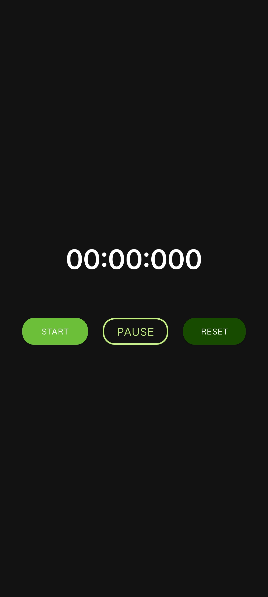
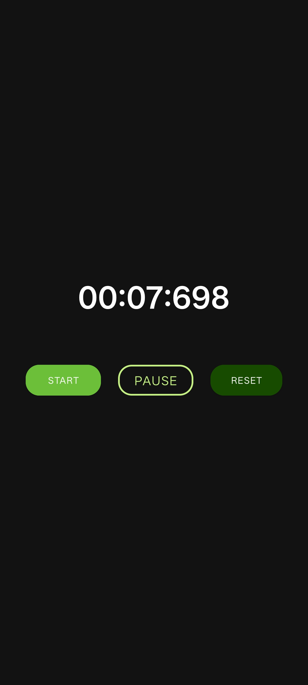

## 📌 3. UzStopWatch (`PRODIGY_AD_03`)

```markdown
# UzStopWatch
**PRODIGY_AD_03**

## Summary
UzStopWatch is a basic stopwatch app that lets users track time with minutes, seconds, and milliseconds. It supports Start, Pause, and Reset functionalities.

## Features
- ▶️ Start timer  
- ⏸️ Pause timer  
- 🔄 Reset timer  
- ⏱️ Accurate time display (minutes, seconds, milliseconds)  

## Tech Stack
- Android Studio (Java/Kotlin)  
- `Handler` & `Runnable` for time updates  
- Material Design buttons  

## Screenshots
  
  

## How to Run
1. Clone the repo:
   ```bash
   git clone https://github.com/<your_username>/PRODIGY_AD_03.git
   cd PRODIGY_AD_03
